# Arquitectura del Sistema - Task Manager

## Diagrama de Arquitectura General

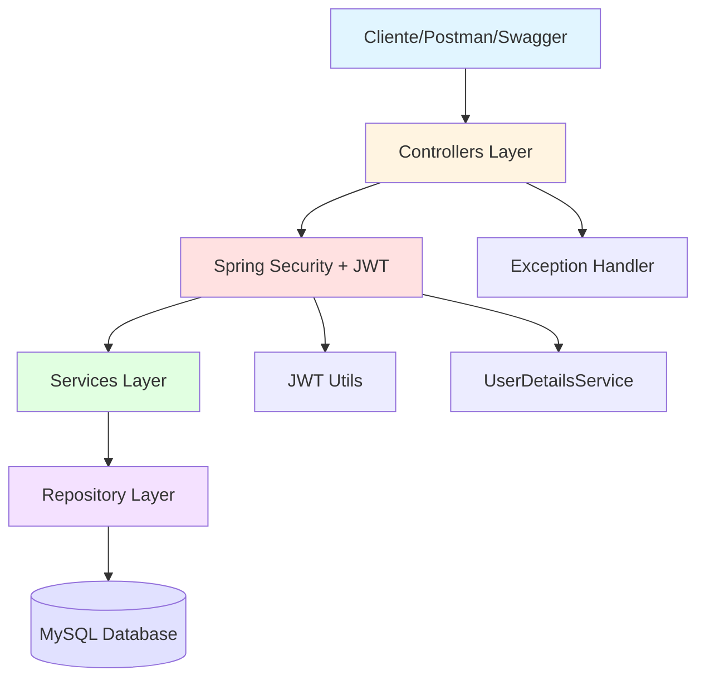

## Diagrama de Capas

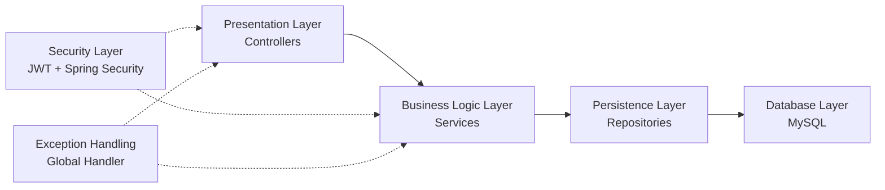

## Flujo de Autenticación

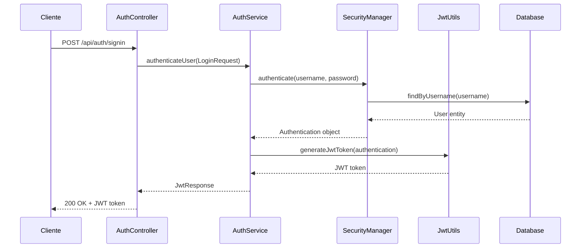

## Flujo de Operación CRUD (Crear Tarea)

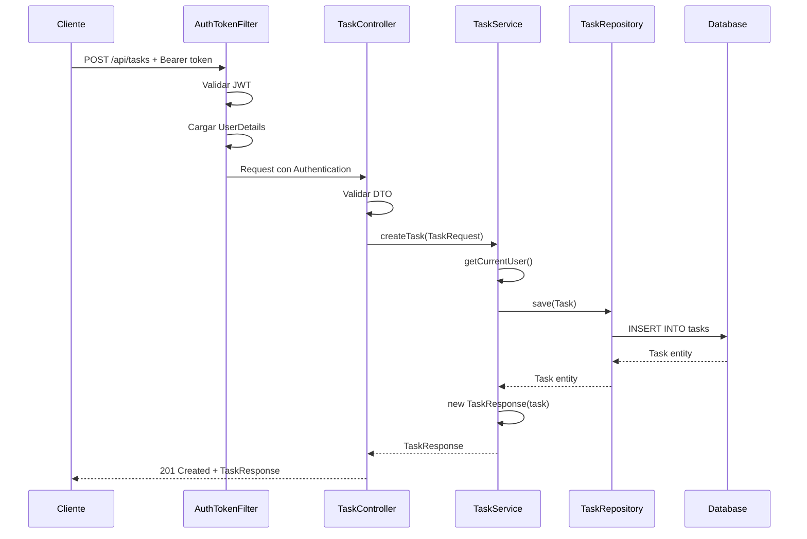

## Diagrama de Clases (Modelo de Dominio)

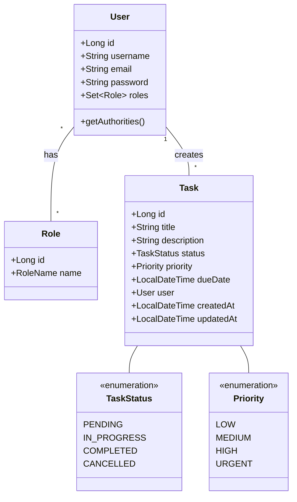

## Estructura de Paquetes

```
com.taskmanager
│
├── config
│   ├── SecurityConfig           # Configuración de Spring Security
│   ├── OpenAPIConfig            # Configuración de Swagger
│   └── DataInitializer          # Inicialización de datos
│
├── controller
│   ├── AuthController           # Endpoints de autenticación
│   └── TaskController           # Endpoints CRUD de tareas
│
├── dto
│   ├── LoginRequest             # Request de login
│   ├── SignupRequest            # Request de registro
│   ├── JwtResponse              # Response con token JWT
│   ├── TaskRequest              # Request para crear/actualizar tarea
│   ├── TaskResponse             # Response con datos de tarea
│   └── MessageResponse          # Response genérico de mensaje
│
├── exception
│   ├── ResourceNotFoundException    # Excepción 404
│   ├── UnauthorizedException        # Excepción 401
│   └── GlobalExceptionHandler       # Manejador global de excepciones
│
├── model
│   ├── User                     # Entidad Usuario
│   ├── Role                     # Entidad Rol
│   └── Task                     # Entidad Tarea
│
├── repository
│   ├── UserRepository           # Repositorio de Usuario
│   ├── RoleRepository           # Repositorio de Rol
│   └── TaskRepository           # Repositorio de Tarea
│
├── security
│   ├── JwtUtils                 # Utilidades para JWT
│   ├── AuthTokenFilter          # Filtro de autenticación
│   ├── AuthEntryPointJwt        # Punto de entrada de autenticación
│   └── UserDetailsServiceImpl   # Implementación de UserDetailsService
│
├── service
│   ├── AuthService              # Lógica de autenticación
│   └── TaskService              # Lógica de negocio de tareas
│
└── TaskManagerApplication       # Clase principal
```

## Flujo de Seguridad

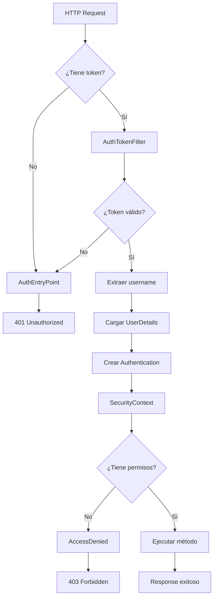

## Matriz de Permisos

| Operación | Endpoint | USER | ADMIN |
|-----------|----------|------|-------|
| Crear tarea | POST /api/tasks | ✅ | ✅ |
| Listar tareas | GET /api/tasks | ✅ (solo sus tareas) | ✅ (todas) |
| Ver tarea | GET /api/tasks/{id} | ✅ (solo sus tareas) | ✅ |
| Actualizar tarea | PUT /api/tasks/{id} | ❌ | ✅ |
| Eliminar tarea | DELETE /api/tasks/{id} | ❌ | ✅ |
| Registrarse | POST /api/auth/signup | ✅ | ✅ |
| Login | POST /api/auth/signin | ✅ | ✅ |

## Tecnologías por Capa

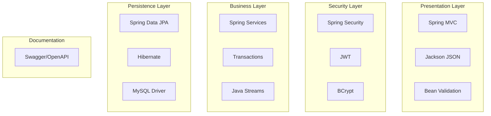

## Flujo de Manejo de Errores

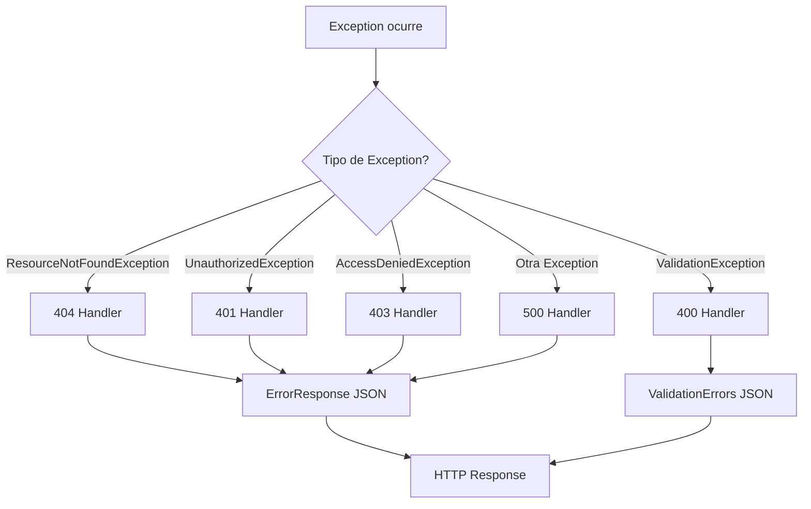

## Patrón de Diseño Aplicados

### 1. MVC (Model-View-Controller)
- **Model**: Entidades (User, Task, Role)
- **View**: JSON responses (DTOs)
- **Controller**: RestControllers

### 2. Repository Pattern
- Abstracción de acceso a datos
- Spring Data JPA

### 3. Service Layer Pattern
- Lógica de negocio separada
- Transaccionalidad

### 4. DTO Pattern
- Transferencia de datos
- Separación de modelo interno

### 5. Factory Pattern
- JwtUtils para crear tokens
- UserDetailsService para crear UserDetails

### 6. Chain of Responsibility
- Filtros de Spring Security
- AuthTokenFilter → SecurityFilterChain

### 7. Strategy Pattern
- PasswordEncoder (BCrypt)
- Diferentes implementaciones de autenticación

---

## Base de Datos - Modelo Relacional

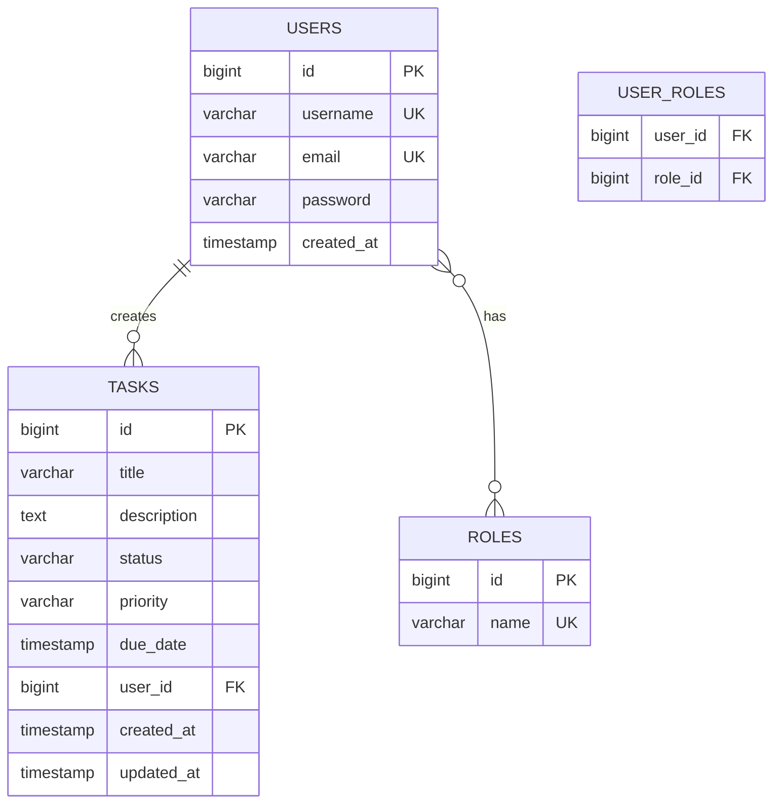

## Configuración de Ambientes

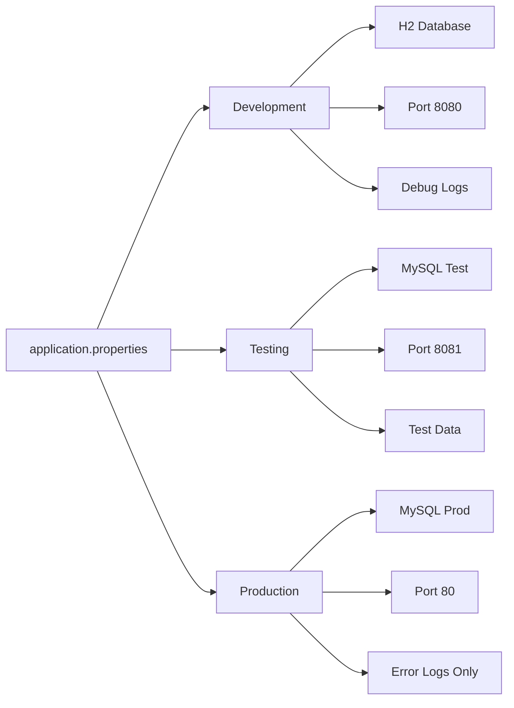

## Ciclo de Vida de Request

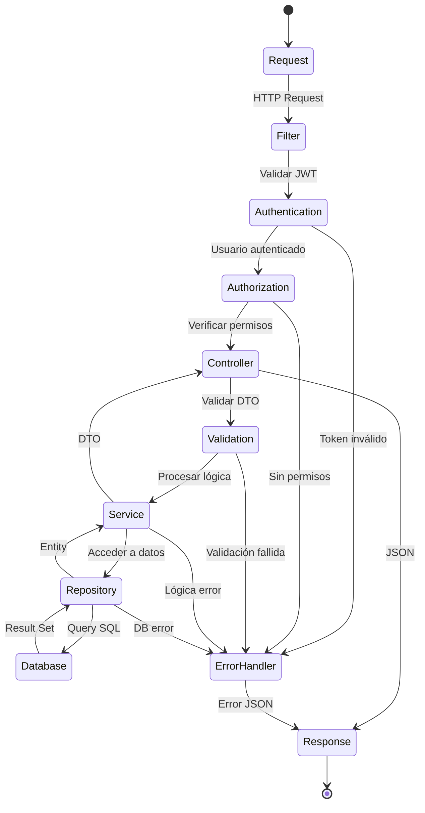

---

Esta documentación proporciona una visión completa de la arquitectura del sistema Task Manager.
